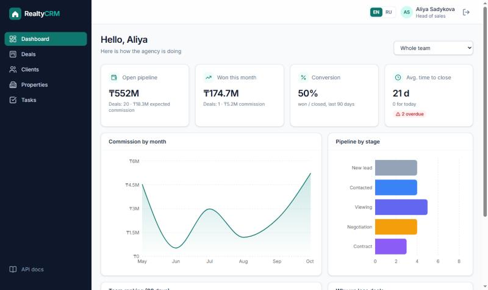
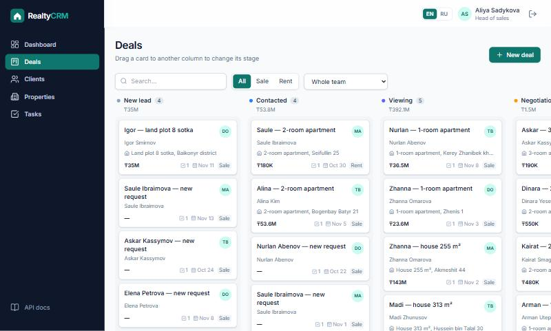
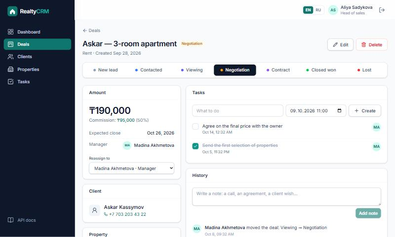
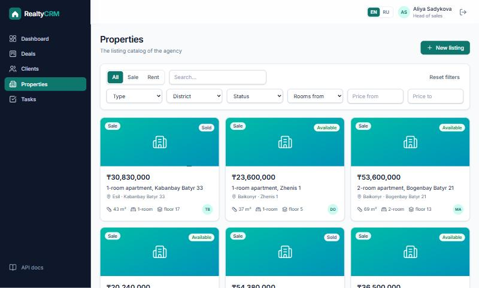
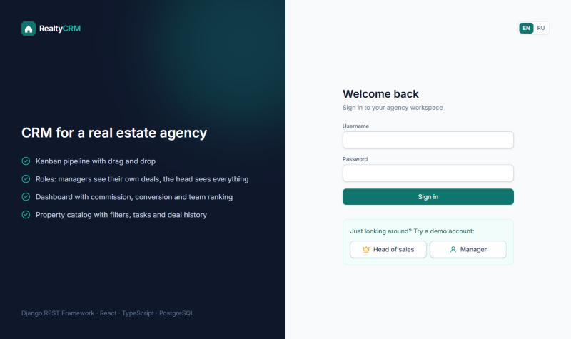
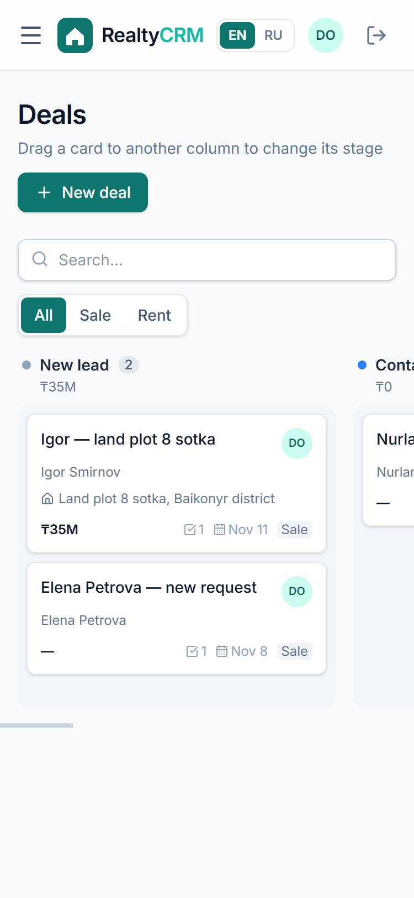

# 🏠 Realty CRM

[](https://github.com/nurpeisovnurbolofficial/realty-crm/actions/workflows/ci.yml)

A CRM for a real estate agency: clients, a property catalog, a **Kanban pipeline of sale and rent deals**,
tasks and a dashboard with commission analytics. Managers work with their own deals, the head of sales sees the whole team.

**Backend:** Python 3.12 · Django 5.2 · Django REST Framework · JWT (httpOnly cookies) · PostgreSQL · OpenAPI/Swagger
**Frontend:** React 19 · TypeScript (strict) · Vite · Tailwind CSS · TanStack Query · dnd-kit · Recharts · i18next (RU/EN)
**Quality:** 50 backend tests on PostgreSQL · 16 frontend tests (Vitest + Testing Library) · ruff · oxlint · Prettier · Docker · GitHub Actions

> 🔗 **Live demo:** _coming soon_ — on the login page click **Head of sales** or **Manager** to try it without signing up.



| Kanban board | Deal page |
|---|---|
|  |  |

| Property catalog | Login with demo accounts | Mobile |
|---|---|---|
|  |  |  |

## Features

- **Deals pipeline** — Kanban board with drag and drop: *New lead → Contacted → Viewing → Negotiation → Contract → Won / Lost*.
  Optimistic updates: the card moves instantly and rolls back if the server rejects the move.
- **Business rules** — a viewing needs a property, a contract needs an amount, a lost deal needs a reason;
  a property under contract is reserved, a won deal marks it sold or rented.
- **Roles** — a manager sees and edits only their own clients, deals and tasks; the head of sales sees everything,
  reassigns deals, reopens closed ones and sees the team ranking.
- **Property catalog** — sale and rent listings in Astana with filters (type, district, status, rooms, price).
- **Deal page** — stage stepper, tasks, notes and an automatic history of every change.
- **Tasks** — overdue / today / upcoming / done.
- **Dashboard** — open pipeline, won this month, conversion, average time to close, commission by month,
  pipeline by stage, reasons for lost deals, team ranking (head only), filter by manager.
- **RU / EN** — the whole UI is translated; API errors come with a stable `code` that the frontend translates.
- **API docs** — Swagger UI at `/api/docs/` generated from the code (schema validated in CI).

## Architecture

```
            ┌──────────────── one Docker image / one URL ────────────────┐
 Browser ──►│  Django + WhiteNoise                                        │
            │   ├─ /            → React app (built by Vite)               │
            │   ├─ /api/...     → Django REST Framework ──► PostgreSQL     │
            │   └─ /api/docs/   → Swagger UI                              │
            └─────────────────────────────────────────────────────────────┘
```

Serving the React build from Django keeps a single origin: no CORS, and the auth cookies can be `SameSite=Lax`.

```
backend/
  accounts/   users with roles, cookie JWT auth, CSRF, login throttling
  crm/
    models.py      Client, Property, Deal, Task, Activity
    services.py    business rules (pipeline, visibility) — used by every view
    serializers.py validation and JSON shape
    views.py       REST endpoints, Kanban board, dashboard
    analytics.py   dashboard queries
frontend/src/
  api/        fetch wrapper (CSRF, token refresh), types, TanStack Query hooks
  pages/      Dashboard, Deals board, Deal, Clients, Properties, Tasks, Login
  components/ UI kit and shared components
  i18n/       en.ts / ru.ts
```

### Data model

```
User (manager | head)
 ├─< Client ──< Deal >── Property
 │                ├─< Task
 │                └─< Activity (notes + automatic history)
 └─< Property (agent)
```

## Security

| Risk | Protection |
|---|---|
| Token theft via XSS | JWT access/refresh tokens live in **httpOnly cookies**; JavaScript never sees them |
| CSRF (cookies are sent automatically) | Every unsafe request must carry Django's CSRF token header |
| Long-lived stolen tokens | Access token lives 15 min; refresh token is rotated and sent only to `/api/auth/` |
| Password brute force | Login is throttled to 5 attempts per minute per IP |
| Seeing other people's data | Querysets are filtered by role in one place (`services.visible_*`) |
| Two deals taking one property | Row locks in a transaction + a partial unique constraint in the database |
| Leaked secret key / public admin password | The app refuses to start without `DJANGO_SECRET_KEY`; admin password only from an env variable |

## Run locally

**Docker** (PostgreSQL included):

```bash
docker compose up --build
```

**Without Docker** — backend and frontend in two terminals:

```bash
cd backend
python -m venv .venv && .venv\Scripts\activate     # macOS/Linux: source .venv/bin/activate
pip install -r requirements-dev.txt
python manage.py migrate
python manage.py seed_demo                          # demo agency in Astana
python manage.py runserver
```

```bash
cd frontend
npm install
npm run dev                                         # http://localhost:5173, API calls are proxied to Django
```

Demo logins: `aliya` (head of sales), `daniyar` / `madina` / `timur` (managers) — the password is printed by `seed_demo`.

## Quality checks

```bash
cd backend && python manage.py test && ruff check . && ruff format --check .
cd frontend && npm test && npm run typecheck && npm run lint && npm run format:check
```

All of them, plus OpenAPI schema validation and a Docker build, run in [GitHub Actions](.github/workflows/ci.yml) on every push.

## Deployment

One Docker image (see [`Dockerfile`](Dockerfile)): Node builds the React app, then Python serves the API and the built files.
Deployed on [Render](https://render.com) with PostgreSQL on [Neon](https://neon.tech).

| Variable | Purpose |
|---|---|
| `DATABASE_URL` | PostgreSQL connection string |
| `DJANGO_SECRET_KEY` | required in production |
| `DJANGO_DEBUG` | `0` in production |
| `DJANGO_ADMIN_PASSWORD` | password of the `admin` account for `/admin/` |

## Roadmap

- [ ] Property photos (S3-compatible storage)
- [ ] Email / Telegram notifications about overdue tasks
- [ ] Import listings from Krisha.kz
- [ ] Audit log export for the head of sales
